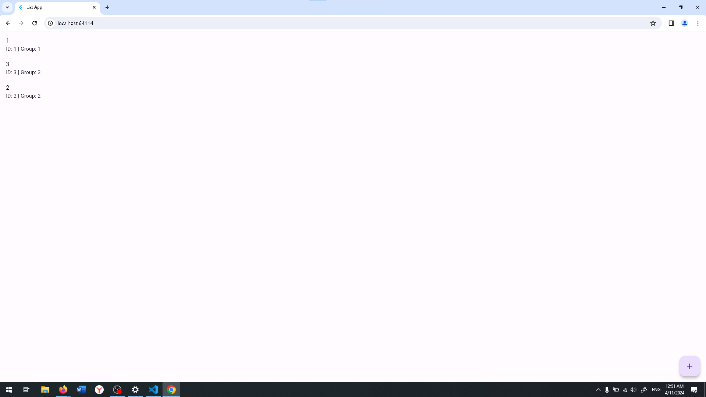
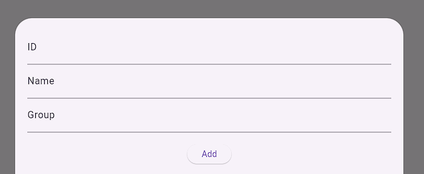
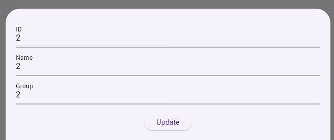

Home page of our application, where we see the list of items and add button

Add modal window, that accur when we click on the bottom button, we can write 3 parameter and then tap to add to the list of items

Update modal window, that accur when we click on the item, we can change all 3 parameter and then tap to update button

Delete modal window, that accur when we long press the item, we can delete, or cancel the action

